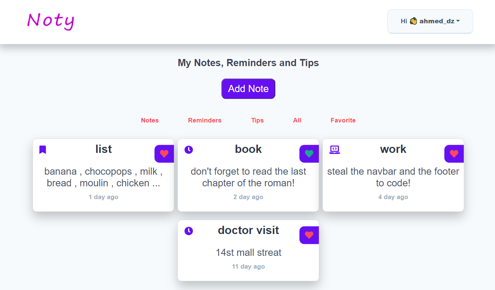

# Noty

**Noty** is a MERN application for saving notes,reminders and tips

### Screenshots

 

### How to use

1. Download the repositry.
2. Install depandencies :
   <code>yarn install</code> or <code>npm install</code>
3. Run <code>yarn start</code> or <code>npm start</code>.
4. Go to [http://localhost:3000](http://localhost:3000)
